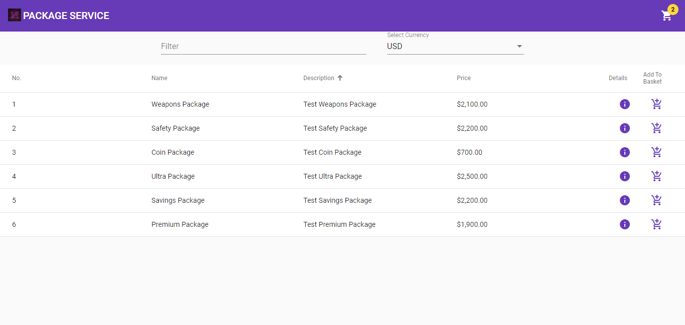

# package-service
Simple Shopping Application. Backend is Spring-Boot microservice, and Frontend is Angular-Material UI

## Setup Backend
import `package-backend` in eclipse and Run `PackageServiceApp.java` to start microservice. 
backend uses `8090` port which is mentioned in `application.properties`.
alternatively run `mvn package spring-boot:repackage` to create a jar and use.

## API Details
API details can be accessed from here `http://localhost:8090/swagger-ui.html`

## Setup Frontend
open `package-frontend` in VSCode or any other editor.
Run `npm install`

## Start Angular Development Server
Run `npm start` Navigate to `http://localhost:4200/`.

## Current Features
  - View Package List
  - See indivdual package info
  - Add Package to basket
  - Open basket to add remove packages
